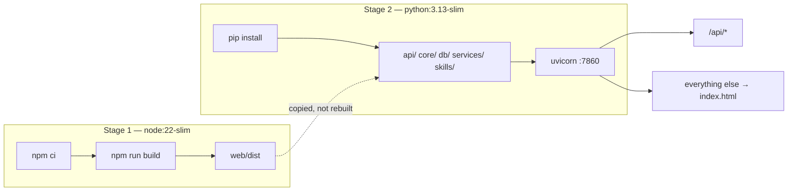

# Deployment

One container. Node builds the React app, Python serves both it and the API from a single
origin, and the data lives in managed Postgres.

Everything below has been run end to end against the real production configuration — the image,
on Neon — before being written down. What has **not** been done is creating the hosting account
and pushing, because that is the author's to do.

---

## What the image is



Two stages because Node and `node_modules` are ~400 MB and are needed only to *produce* a folder
of static files, never to serve them. Only `web/dist` crosses the boundary.

**Measured:** the final image is **563 MB**.

### The catch-all matters more than it looks

React Router owns paths like `/w/4/dashboard`. Those exist only in the browser — ask the server
for one by refreshing, and a plain static mount returns 404. That is the single most common way
a deployed SPA is broken, so [`api/static.py`](../api/static.py) returns `index.html` for unknown
paths and [`tests/test_static.py`](../tests/test_static.py) pins the three things that must hold:

| Rule | Why |
|---|---|
| `/api/*` is never swallowed | Otherwise a missing endpoint returns 200 with HTML in it |
| A real asset wins over the shell | Otherwise the browser refuses to execute the JS and the page is blank |
| No path escapes `web/dist` | `/../../.env` is a request for a secret, not a route |

---

## Where to deploy it

**Hugging Face Spaces is no longer an option on a free account.** The Docker SDK moved behind a
PRO plan — the Space creation screen now marks it *Paid*, and Static and Gradio are the only free
SDKs. Neither can serve a FastAPI application, so the plan changed.

The constraint that decided the replacement was **memory**, and it was measured rather than
guessed:

| State | Memory |
|---|---|
| Idle, after startup | **139 MB** |
| After a document upload, embedding pass, chat turn and memory extraction | **160 MB** |

That fits a 512 MB free instance with room to spare, which puts Render and Koyeb both in reach.

| Platform | Free tier | Card needed | Notes |
|---|---|---|---|
| **Render** *(recommended)* | 512 MB, Docker | No | Blueprint file committed. Sleeps after ~15 min idle |
| Koyeb | 512 MB, 0.1 vCPU, Docker | No | One service; a fine fallback |
| Hugging Face Spaces | — | PRO required | Docker SDK is paid as of 2026 |
| Fly.io | — | Yes | Free tier withdrawn |

---

## Deploying to Render

[`render.yaml`](../render.yaml) is committed, so most of this is clicking.

### 1. Push the repository to GitHub

Render deploys from a Git remote, so the project needs to be on GitHub first.

### 2. Create the service

Render Dashboard → **New** → **Blueprint** → select the repository. It reads `render.yaml` and
finds the Docker web service on the free plan.

### 3. Fill in the secrets

Render prompts for every variable marked `sync: false` — nothing secret is in the committed file.

| Variable | Value |
|---|---|
| `DATABASE_URL` | The Neon **pooler** connection string (the host containing `-pooler`) |
| `JWT_SECRET` | A **fresh** 48-character random string, not the local one |
| `GROQ_API_KEY` | Primary provider |
| `GROQ_API_KEY_2` | Second Groq **organisation** — a real second allowance. Blank is fine |
| `GOOGLE_API_KEY` | Embeddings, and a chat fallback |

Generate the secret with:

```bash
python -c "import secrets; print(secrets.token_urlsafe(48))"
```

> `DATABASE_URL` is what decides whether this is a platform or a demo. A free instance restarts
> with an empty filesystem, so on SQLite every account and conversation would disappear on each
> deploy.

### 4. Wait for the build

First build is roughly 5–10 minutes — it runs both Docker stages. Render supplies `$PORT`, which
the Dockerfile's `CMD` already honours, and polls `/api/health` before sending traffic.

### 5. Verify the live URL

```bash
python scripts/verify_phase11.py --url https://<your-service>.onrender.com
```

Same script that was run against the local container. It registers a new account, uploads a
document, checks the answer is grounded **and** cited, signs in again as a second session to
confirm memory carried over, and confirms another user gets 403 on all of it.

### Free-tier behaviour worth knowing

- **It sleeps after ~15 minutes idle**, and the next request pays a cold start of roughly a
  minute — the container boot plus this application's own startup. **Open the URL a few minutes
  before demonstrating it to anyone.**
- **0.1 CPU** is slow at boot but irrelevant afterwards: 97% of a chat request is waiting on the
  model provider, not on this process.

---

## Verified locally, in the production configuration

The image was built and run against the real Neon database before any of this was written:

```
API ready - PostgreSQL, provider chain: groq -> groq2 -> google
Serving the SPA from web/dist
Synced 9 skill definitions into the database
```

and the gate against that container:

```
PHASE 11 PASSED - register, cite, recall and isolate, all over HTTP.
```

Reproduce it yourself:

```bash
docker build -t ai-workspace .
```
```bash
docker run -d -p 7860:7860 --env-file .env -e PORT=7860 ai-workspace
```
```bash
python scripts/verify_phase11.py
```

> Using `--env-file .env` locally is fine; **never** bake `.env` into the image. `.dockerignore`
> excludes it for exactly that reason — a secret copied into a layer survives being deleted in a
> later step and travels wherever the image goes.

---

## What is ephemeral, stated plainly

| Data | Survives a restart? |
|---|---|
| Accounts, workspaces, conversations, memory, prompts | **Yes** — Neon Postgres |
| Document text, chunks, embeddings, citations | **Yes** — stored as rows |
| The uploaded **original files** | **No** — container filesystem |

So a document keeps answering questions after a restart; only "download the original file"
would break. The fix is a persistent disk, which Render offers on paid plans.

## Other things worth knowing before a demo

- **One worker, on purpose.** The rate limiter counts in-process, so N workers would multiply
  every limit by N. Scaling out needs a shared store such as Redis.
- **Free-tier quotas are real.** Google allows 1,000 embedding requests per day; past that,
  retrieval degrades to keyword-only and the UI says so.
- **`postgresql://` is rewritten automatically.** SQLAlchemy maps that bare scheme to psycopg2,
  which is not installed here, so `normalise_database_url` rewrites it to `postgresql+psycopg://`.
  Paste the provider's string verbatim and it works.
