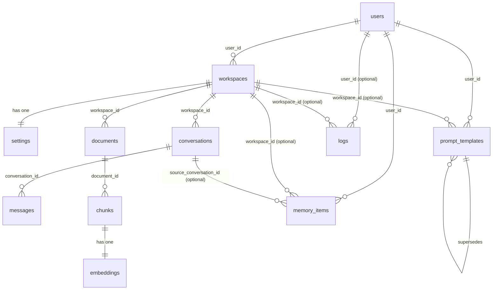

# Entity Relationship Diagram

**Generated from `db/models.py` — do not edit the diagram or the tables by hand.**

```bash
python scripts/generate_erd.py
```

**12 tables**, 112 columns, 15 foreign keys.

---

## Diagram



`skills` has no foreign key: it mirrors the code registry in `skills/` and is global rather than owned.

---

## Tables

### `users`

An account. The root of every ownership chain.

| Column | Type | Null | Key | Default |
|---|---|:--:|---|---|
| `id` | INTEGER | no | PK | — |
| `email` | VARCHAR(255) | no | unique, indexed | — |
| `password_hash` | VARCHAR(255) | no | — | — |
| `display_name` | VARCHAR(120) | yes | — | — |
| `is_active` | BOOLEAN | no | — | `True` |
| `created_at` | DATETIME | no | — | generated |

### `workspaces`

The unit of isolation. Owns its conversations, documents and configuration.

| Column | Type | Null | Key | Default |
|---|---|:--:|---|---|
| `id` | INTEGER | no | PK | — |
| `user_id` | INTEGER | no | FK → `users.id`, indexed | — |
| `name` | VARCHAR(120) | no | — | — |
| `description` | TEXT | yes | — | — |
| `icon` | VARCHAR(40) | no | — | `folder` |
| `created_at` | DATETIME | no | — | generated |

### `settings`

One assistant configuration per workspace — the eight tunable fields.

| Column | Type | Null | Key | Default |
|---|---|:--:|---|---|
| `id` | INTEGER | no | PK | — |
| `workspace_id` | INTEGER | no | FK → `workspaces.id`, unique, indexed | — |
| `assistant_name` | VARCHAR(120) | no | — | `Assistant` |
| `role` | VARCHAR(200) | no | — | `General assistant` |
| `system_prompt` | TEXT | no | — | `You are a helpful, precise assistant.` |
| `model` | VARCHAR(120) | yes | — | — |
| `temperature` | FLOAT | no | — | `0.3` |
| `max_tokens` | INTEGER | no | — | `2048` |
| `personality` | VARCHAR(60) | no | — | `professional` |
| `response_style` | VARCHAR(60) | no | — | `balanced` |
| `use_memory` | BOOLEAN | no | — | `True` |
| `use_knowledge_base` | BOOLEAN | no | — | `True` |

### `conversations`

A chat thread inside a workspace.

| Column | Type | Null | Key | Default |
|---|---|:--:|---|---|
| `id` | INTEGER | no | PK | — |
| `workspace_id` | INTEGER | no | FK → `workspaces.id`, indexed | — |
| `title` | VARCHAR(200) | no | — | `New conversation` |
| `session_id` | VARCHAR(64) | no | indexed | — |
| `is_pinned` | BOOLEAN | no | — | `False` |
| `tags` | JSON | no | — | generated |
| `created_at` | DATETIME | no | — | generated |
| `updated_at` | DATETIME | no | — | generated |

### `messages`

One turn. Carries its own citations, token counts, cost and latency.

| Column | Type | Null | Key | Default |
|---|---|:--:|---|---|
| `id` | INTEGER | no | PK | — |
| `conversation_id` | INTEGER | no | FK → `conversations.id`, indexed | — |
| `role` | VARCHAR(20) | no | — | — |
| `content` | TEXT | no | — | — |
| `citations` | JSON | no | — | generated |
| `memory_used` | JSON | no | — | generated |
| `is_pinned` | BOOLEAN | no | — | `False` |
| `model` | VARCHAR(120) | yes | — | — |
| `tokens_in` | INTEGER | no | — | `0` |
| `tokens_out` | INTEGER | no | — | `0` |
| `cost_usd` | FLOAT | no | — | `0.0` |
| `latency_ms` | INTEGER | no | — | `0` |
| `created_at` | DATETIME | no | indexed | generated |

### `documents`

An uploaded file and its ingestion status.

| Column | Type | Null | Key | Default |
|---|---|:--:|---|---|
| `id` | INTEGER | no | PK | — |
| `workspace_id` | INTEGER | no | FK → `workspaces.id`, indexed | — |
| `filename` | VARCHAR(255) | no | — | — |
| `stored_path` | VARCHAR(500) | no | — | — |
| `mime_type` | VARCHAR(120) | no | — | — |
| `size_bytes` | INTEGER | no | — | `0` |
| `page_count` | INTEGER | no | — | `0` |
| `chunk_count` | INTEGER | no | — | `0` |
| `status` | VARCHAR(20) | no | indexed | `pending` |
| `error` | TEXT | yes | — | — |
| `created_at` | DATETIME | no | — | generated |

### `chunks`

A slice of a document, remembering the page it came from.

| Column | Type | Null | Key | Default |
|---|---|:--:|---|---|
| `id` | INTEGER | no | PK | — |
| `document_id` | INTEGER | no | FK → `documents.id`, indexed | — |
| `ordinal` | INTEGER | no | — | — |
| `text` | TEXT | no | — | — |
| `page` | INTEGER | yes | — | — |
| `char_start` | INTEGER | no | — | `0` |
| `char_end` | INTEGER | no | — | `0` |

### `embeddings`

One vector per chunk.

| Column | Type | Null | Key | Default |
|---|---|:--:|---|---|
| `id` | INTEGER | no | PK | — |
| `chunk_id` | INTEGER | no | FK → `chunks.id`, unique, indexed | — |
| `model` | VARCHAR(120) | no | — | — |
| `dim` | INTEGER | no | — | — |
| `vector` | JSON | no | — | — |
| `created_at` | DATETIME | no | — | generated |

### `memory_items`

What the assistant remembers about a user.

| Column | Type | Null | Key | Default |
|---|---|:--:|---|---|
| `id` | INTEGER | no | PK | — |
| `user_id` | INTEGER | no | FK → `users.id`, indexed | — |
| `workspace_id` | INTEGER | yes | FK → `workspaces.id`, indexed | — |
| `kind` | VARCHAR(20) | no | indexed | `fact` |
| `content` | TEXT | no | — | — |
| `importance` | FLOAT | no | — | `0.5` |
| `is_pinned` | BOOLEAN | no | — | `False` |
| `source_conversation_id` | INTEGER | yes | FK → `conversations.id` | — |
| `use_count` | INTEGER | no | — | `0` |
| `last_used_at` | DATETIME | yes | — | — |
| `created_at` | DATETIME | no | indexed | generated |

### `prompt_templates`

The prompt library. Versioned by insertion, never mutation.

| Column | Type | Null | Key | Default |
|---|---|:--:|---|---|
| `id` | INTEGER | no | PK | — |
| `user_id` | INTEGER | no | FK → `users.id`, indexed | — |
| `workspace_id` | INTEGER | yes | FK → `workspaces.id`, indexed | — |
| `title` | VARCHAR(200) | no | — | — |
| `body` | TEXT | no | — | — |
| `category` | VARCHAR(40) | no | indexed | `custom` |
| `version` | INTEGER | no | — | `1` |
| `parent_id` | INTEGER | yes | FK → `prompt_templates.id` | — |
| `is_current` | BOOLEAN | no | indexed | `True` |
| `use_count` | INTEGER | no | — | `0` |
| `created_at` | DATETIME | no | — | generated |

### `skills`

Mirrors the code registry so skills are listable and countable.

| Column | Type | Null | Key | Default |
|---|---|:--:|---|---|
| `id` | INTEGER | no | PK | — |
| `slug` | VARCHAR(60) | no | unique, indexed | — |
| `name` | VARCHAR(120) | no | — | — |
| `category` | VARCHAR(40) | no | — | `general` |
| `description` | TEXT | no | — | — |
| `icon` | VARCHAR(40) | no | — | `sparkles` |
| `enabled` | BOOLEAN | no | — | `True` |
| `use_count` | INTEGER | no | — | `0` |

### `logs`

Every billable event. Powers the dashboard.

| Column | Type | Null | Key | Default |
|---|---|:--:|---|---|
| `id` | INTEGER | no | PK | — |
| `user_id` | INTEGER | yes | FK → `users.id`, indexed | — |
| `workspace_id` | INTEGER | yes | FK → `workspaces.id`, indexed | — |
| `event` | VARCHAR(40) | no | indexed | — |
| `detail` | TEXT | yes | — | — |
| `provider` | VARCHAR(40) | yes | — | — |
| `model` | VARCHAR(120) | yes | — | — |
| `tokens_in` | INTEGER | no | — | `0` |
| `tokens_out` | INTEGER | no | — | `0` |
| `cost_usd` | FLOAT | no | — | `0.0` |
| `latency_ms` | INTEGER | no | — | `0` |
| `status` | VARCHAR(20) | no | indexed | `ok` |
| `created_at` | DATETIME | no | indexed | generated |

---
## Four decisions worth defending

### 1. `prompt_templates.parent_id` — versioning by insertion

Editing a prompt **inserts a new row** pointing at its parent and increments `version`. Nothing is
ever overwritten.

The alternative — updating the row in place — silently rewrites history: a conversation that ran
against version 1 would, when reopened, appear to have used version 3. Since the whole platform
is built on being able to say *where an answer came from*, a prompt that changes underneath a
past answer breaks the one promise that matters. The cost is rows that accumulate; the benefit is
that an old conversation still points at the exact text that produced it.

### 2. `messages.citations` is denormalised JSON

Citations could be a join table onto `chunks`. They are stored on the message instead.

A citation is a record of *what the model was actually shown*, not a live pointer. If the user
deletes the document, the old answer must still show what it was based on — a join would either
break or, worse, quietly resolve to a different chunk after re-ingestion. The same reasoning
applies to `memory_used`. This trades normal form for the ability to answer "why did it say
that?" a month later, which is the trade this platform exists to make.

### 3. `embeddings.vector` is JSON, behind an interface

Vectors are stored as JSON arrays and compared in Python. That is honest about what it is: fine
at thousands of chunks, wrong at millions, because every query loads every vector in the
workspace.

It is written behind a `VectorStore` interface so pgvector can replace it without touching a
single caller. Reaching for pgvector on day one would have meant a Postgres dependency for local
development and the test suite, to solve a scaling problem the project does not yet have.

### 4. Every ownership path leads back to `users` in one hop or two

`workspaces.user_id` is the only branch point. Documents, conversations, chunks and messages
inherit isolation through their workspace rather than each carrying their own `user_id`.

One chain means one place to check, which is why `get_owned_workspace` can be a single dependency
rather than a rule every route re-implements. `memory_items` and `prompt_templates` carry
`user_id` directly and a **nullable** `workspace_id`, because a preference like *"answer in
British English"* belongs to the person, not to one of their workspaces.

## Cascades

Foreign keys are declared `ON DELETE CASCADE` down each ownership chain, so deleting a workspace
removes its conversations, messages, documents, chunks and embeddings.

SQLite ships with foreign-key enforcement **off**, so `PRAGMA foreign_keys=ON` is issued on every
connection in `tests/conftest.py`. Without it a cascade test passes while cascading nothing —
the deletion appears to work and orphans accumulate.

